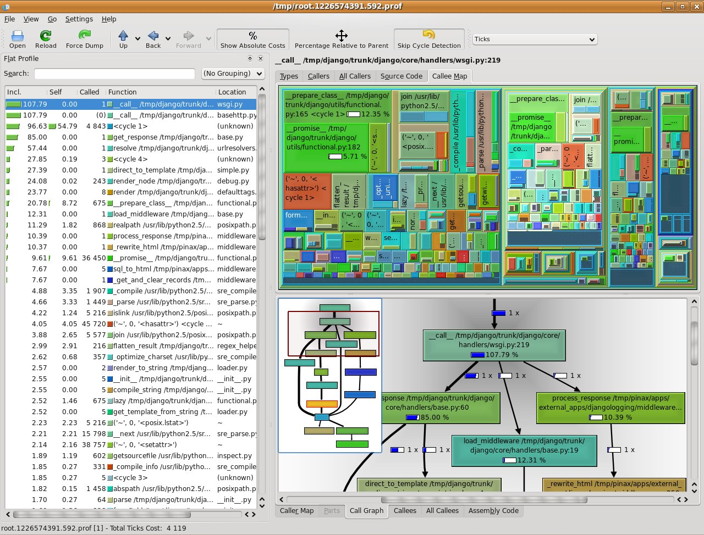

# Теория производительности
Что такое производительность?

* Сокращение времени на получение результата
* Увеличение частоты вычислений для получения серии результатов 
* Снижение энергопотребления на вычисления 

Все эти пункты относятся к производительности и их мы можем достичь через параллелизацию приложения.

При создании приложения мы должны определить цели. Какие показатели приложения мы хотим достичь. Эти показатели мы должны достигать итеративно, пока не достигнем намеченных целей. 

Очень важная часть процесса оптимизации это процесс проверки приложения после каждого изменения. Быстрые вычисления и неправильный результат нам не нужны. Поэтому процесс проверки не позволит вам потратить время впустую на оптимизацию уже сломанного приложения.

К проверке приложения следует подходить очень осторожно. Достижения такого же результата для параллельных приложений в некоторых областях может быть трудно достижимо.

В ходе оптимизации нужно всегда отслеживать производительность для мониторинга достижения наших целей. Мы можем замерять производительность определённой конфигурации оборудования или с помощью аналитических моделей. Моделирование можно произвести с помощью инструмента **Valgrind** для Linux систем. 
Оба варианта достаточно хороши. Замеры могут показать почему производительность не может быть улучшена или почему она ограничена. Иногда аналитические оценки алгоритмов могут не учитывать очень важный для параллельных приложений факт как масштабируемость. 
Я рекомендую руководствоваться аналитическими оценками алгоритмов для выбора того или иного алгоритма. После реализации выбранного алгоритма проводить замеры, что бы понять какие эффекты проигнорировали аналитические оценки.


#### Ускорение и эффективность 

Очень важные две метрики, характеризующие производительность и параллелизм, ускорение и эффективность. 

  $$Ускорение=S_p={T_1 \over T_p}.$$
 
Ускорением параллельного алгоритма называют отношение времени выполнения последовательного алгоритма к времени выполнения параллельного алгоритма.

$$ Эффективность={ S_p \over P}={T_1 \over PT_p}.$$

Эффективность это ускорение поделённое на число параллельных потоков. Она измеряет окупаемость инвестиции в оборудование. Идеальная эффективность это 1 (чаще говорят 100%), она соответствует линейному ускорению. На практике, множество факторов делают эффективность ниже идеальной.  

#### Инструменты для анализа

##### Valgrind
В него входят следующие модули-анализаторы:
* **memcheck**- основной модуль, обеспечивающий обнаружение утечек памяти, и прочих ошибок, связанных с неправильной работой с областями памяти — чтением или записью за пределами выделенных регионов и т.п.
* **cachegrind** - анализирует выполнение кода, собирая данные о (не)попаданиях в кэш, и точках перехода (когда процессор неправильно предсказывает ветвление). Эта статистика собирается для всей программы, отдельных функций и строк кода.
* **callgrind** - анализирует вызовы функций, используя примерно ту же методику, что и модуль cachegrind. Позволяет построить дерево вызовов функций, и соответственно, проанализировать узкие места в работе программы.
* **massif** - позволяет проанализировать выделение памяти различными частями программы.
* **helgrind** - анализирует выполняемый код на наличие различных ошибок синхронизации, при использовании многопоточного кода, использующего POSIX Threads.

Пример статистики модуля Valgrind  cachegrind:

```
I   refs:      1,873,023
I1  misses:        2,222
L2i misses:        2,057
I1  miss rate:      0.11%
L2i miss rate:      0.10%

D   refs:        808,914  (578,685 rd   + 230,229 wr)
D1  misses:        9,785  (  9,212 rd   +     573 wr)
L2d misses:        5,119  (  4,757 rd   +     362 wr)
D1  miss rate:       1.2% (    1.5%     +     0.2%  )
L2d miss rate:       0.6% (    0.8%     +     0.1%  )

L2 refs:          12,007  ( 11,434 rd   +     573 wr)
L2 misses:         7,176  (  6,814 rd   +     362 wr)
L2 miss rate:        0.2% (    0.2%     +     0.1%  )
```


Графически представить результаты можно с помощью **kcachegrind**
