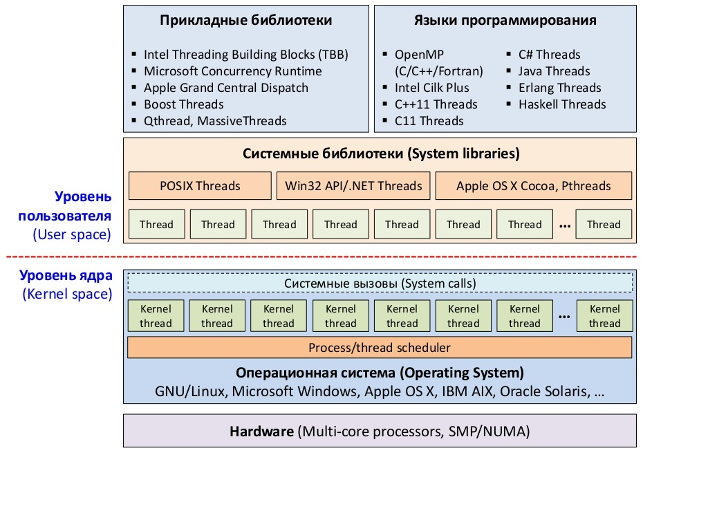

# Начало

Технологий параллельного программирования существует множество. Все они отличаются между собой архитектурой построения пареллельных систем.



Рост тактовой частоты прекратился и производители процессоров переходят на создание многоядерных архитектур. Идея проста: взять более одного ядра и поместить их в один чип. Это позволяет системе с двух ядерным процессором работать как двух процессорный, а четырёх ядерному как система с четыремя процессорами. Такая практика помогает избежать множество технологических проблем связанных с увеличением скорости, а производителям по прежнему предоставлять более производительные процессоры.

Это выглядело великолепно, но вы не получали выигрыша от таких процессоров, если ваше приложение не было готово оперировать с несколькими ядрами. Проблематика заключается в том, что приложения не успевают за аппаратным прогрессом.

Так пришло время OpenMP. Она помогает С++ разработчикам быстро создавать многопоточные приложения. Непосредственно с потоками вы работать не будете. Мы будет указывать с помощью деректив компилятору блоки кода, которые можно распараллелить.

Приложения начинаются с одним потоком - **главным \(master\) потоком**, он всегда создается когда начинается работа приложения и существует в течении всего времени работы программы. В ходе выполнения, **главный \(master\) поток** может порождать набор **подчиненных \(slave\) потоков** для выполения работы. Область кода, которая исполняется параллельно, называется **параллельным регионом**.


Рассмотрим схематичный пример. У нас есть приложение и алгоритм действий. **А Б В Г**, а за ним следует **А Б В**. Мы знаем, что нам нужно сначала выполнить **А Б В Г**. Однако, порядок выполнения нам не важен, можно и **В Г А Б**. Это потенциальное место для параллелизации. У нас есть действия, которые мы можем выполнять независимо от друг друга. Для нас это будет **параллельным регионом 1** 


Помимо этого мы знаем, что вторая часть программы **А Б В** так же может быть выполнена в любом порядке. Следовательно, **А Б В** станет **паралельным регионом 2**

## Основые конструкции

В OpenMP основные составляющие: прагмы и функции. Прагмы являются директивами компилятора, которые непосредственно указывают на особые участки кода. Все прагмы начинаются с \#pragma omp. Как и другие прагмы компилятора, в случае, если компилятор их не поддерживает, они игнорируются.

Для добавления параллельных областей существует несколько основных

```text
#pragma omp <директива>

примеры :

#pragma omp parallel 
#pragma omp for
#pragma omp master
#pragma omp single
```

OpenMP поддерживает директивы private, parallel, for, section, sections, single, master, critical, flush, ordered и atomic и ряд других, которые определяют механизмы разделения работы или конструкции синхронизации.

