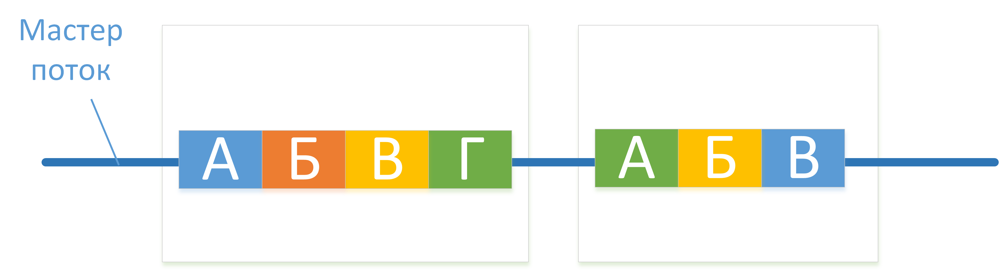

# Почему OpenMP?

Рост тактовой частоты прекратился и производители процессоров переходят на создание мноядерных архитектур. Идея проста: взять более одного ядра и поместить их в один чип. Это позволяет системе с двух ядерным процессором работать как двух процессорный, а четырех ядерному как система с цетыремя процессорами. Такая практика помогает избежать множество технологических проблем связанных с увеличением скорости, а производителям по прежнему предоставлять более производительные процессоры.

Это выглядело великолепно, но вы не получали выйгрыша от таких процессоров, если ваше приложение не было готово оперировать с несколькими ядрами. Так пришло время OpenMP. Она помогает С++ разработчикам быстро создавать многопоточные приложения.

Приложения начинаются с одним потоком - **мастер потоком**. В ходе выполнения программы,  главный поток может порождать другие потоки для выполения работы. Область кода, которая исполняется паралельно, называется **паралельным регионом**. 

Рассмотрим схематичный пример. У нас есть приложение, в котором есть некий алгоритм действий. А Б В Г, а за ним следует А Б В. Мы  знаем, что нам нужно сначала выполнить А Б В Г. Однако, порядок выполнения нам не важен, можно и В Г А Б. Это потенциальное место для параллелизации. У нас есть действия, которые мы можем выполнять независимо. Для нас это будет **паралельным регионом 1 ** 

Помимо этого мы знаем, что вторая часть программы А Б В так же может быть выполнена в любом порядке. Следовательно А Б В  станет **паралельным регионом 2**