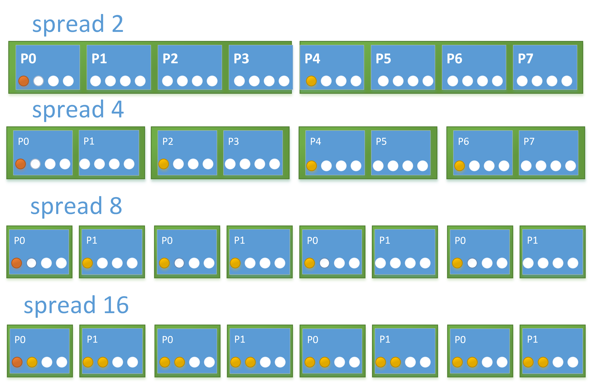
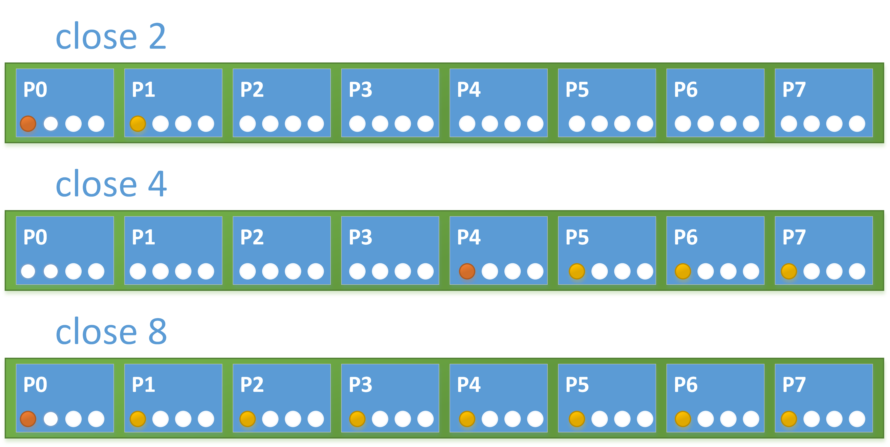

# Размещение потоков

##### *Жуткая вещь — переезд. Не знаешь, где найдешь, где потеряешь.*
###### Скотт Вестерфельд. Тайный час


По умолчанию, OpenMP потокам разрешено мигрировать между логическими и физическими ядрами во время выполения. Это часто становится причиной падения производительности. Поток мигрирует с одного ядра на другое, теряя доступ к данным, находящимся в локальном кэше ядра. Данные, для дальнейшей работы, нужно заново загружать в локальный кэш нового ядра. Увеличить производительность приложение возможно путем привязки OpenMP потоков к логическими или физическими ядрам. Привязка потоков называется thread affinity.

В различных компиляторах до принятия стандарта OpenMP 4.0 были собственные реализации шаблонов размещения потоков. Например, KMP_AFFINITY, для компиляторов от компании Intel.

Теперь же стандартизирована политика размещения потоков. Как размещать потоки мы можем указать в коде или же через переменные окружения.

Существует на данный момент три политики размещения.

```
export OMP_PROC_BIND= "spread"
#pragma omp parallel proc_bind(spread) num_threads(N)
```
spread - распределить потоки равномерно. Политика обеспечивает лучший доступ аппаратным ресурсам.


```
export OMP_PROC_BIND= "close"
#pragma omp parallel proc_bind(close) num_threads(N)
```
close -  размещать потоки последовательно как можно ближе к мастер потоку. Используется если желательно совместное использование ресурсов потоками.


```
export OMP_PROC_BIND= "master"
#pragma omp parallel proc_bind(master) num_threads(N)
```
master - размещать потоки на том же месте где и мастер поток. Обеспечивает близость к мастер потоку


```
export OMP_PROC_BIND= "true"
export OMP_PROC_BIND= "false"

```
В случае если выставлен OMP_PROC_BIND= "false", то все политики размещения будут проигнорированы.
Помимо выставления политик мы можем сами разместить потоки на нашей архитектуре. Такое возможно через переменную окружения OMP_PLACES.
Перед этим стоит упямянуть о тех обозначениях, которые возможно вы будете встречать в иностранной литературе.
Мы рассмотрим на большом примере, что бы наглядно увидеть как работает каждый вариант.

*Нумерация может отличатся, так как она зависит от операционной системы и производителя оборудования. *

```
export OMP_PLACES = threads 

 {0},{24},{4},{28},{8},{32},{12},{36},{16},{40},{20},{44},{1},{25}, … , {23},{47}

```
Каждый OpenMP поток будет закреплен к каждому аппаратному гиперпотоку потоку. 

```
export OMP_PLACES = cores 
{0,24}, {4,28}, {8,32}, {12,36}, {16,40}, {20,44}, {1,25}, … , {23,47}
```
Каждый OpenMP поток будет закреплен к аппаратному ядру и будет иметь возможность мигрировать между гиперпотоками своего ядра. 
```
export OMP_PLACES = sockets 
{0, 24, 4, 28, 8, 32, 12, 36, 16, 40, 20, 44}, {1,25,…}, {…} , {…,23,47}
```
Каждый OpenMP поток будет закреплен к центральному процессору своего сокета. Миграция возможна между ядрами и гиперпотоками своего сокета.
Явную нумерацию можно использовать напрямую указывая номера или с помощью шаблона.
```
export OMP_PLACES "{0,1,2,3},{4,5,6,7},{8,9,10,11}, … {28,29,30,31}"

export OMP_PLACES "{0:4}:8:4"

{<границы>}:<число вхождений>:<шаг>
```
Обе верхние записи сделают одно и тоже.

Как же узнать топологию центрального процессора?

Стандартная команда lscpu выведет подробную информацию о вашем центральном процессоре.
```
rus@ubuntu:~$ lscpu
Architecture:          x86_64
CPU op-mode(s):        32-bit, 64-bit
Byte Order:            Little Endian
CPU(s):                2
On-line CPU(s) list:   0,1
Thread(s) per core:    1
Core(s) per socket:    2
Socket(s):             1
NUMA node(s):          1
Vendor ID:             GenuineIntel
CPU family:            6
Model:                 58
Stepping:              9
CPU MHz:               2793.665
BogoMIPS:              5587.33
Hypervisor vendor:     VMware
Virtualization type:   full
L1d cache:             32K
L1i cache:             32K
L2 cache:              256K
L3 cache:              3072K
NUMA node0 CPU(s):     0,1
```
Так же можно с помощью утилиты hwloc графически увидеть вашу архитектуру.
```
rus@ubuntu:~$ sudo apt-get install hwloc
rus@ubuntu:~$ lstopo
```


```
set OMP_DISPLAY_ENV=true
```

Установив  OMP_DISPLAY_ENV на true, программа выведет все переменные окружения относящиеся к OpenMP.


 

Пример:

Как распределить потоки внешнего цикла равномерно между всеми физическими ядрами для достижения наибольшей пропускной способности памяти, а потоки внутреннего цикла последовательно друг за другом для локальности общих данных?

Решение:
Для внутреннего цикла воспользоваться close, а для внешнего spread. Используя дериктивы, получим следующую конструкцию.
```
#pragma omp parallel proc_bind(spread)
{
    #pragma omp parallel proc_bind(close)
    {
    
    ....
    }

}

```
А вот как это будет работать.


 