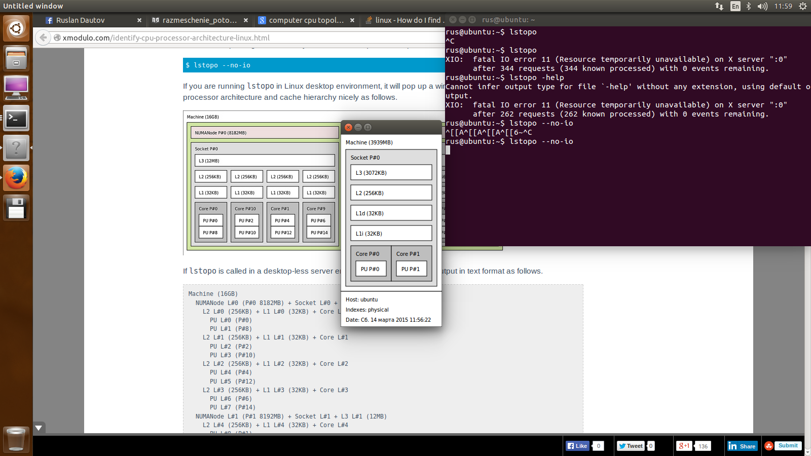
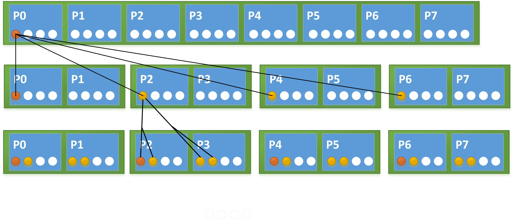

# Размещение потоков

##### *Жуткая вещь — переезд. Не знаешь, где найдешь, где потеряешь.*
###### Скотт Вестерфельд. Тайный час


По умолчению, OpenMP потокам разрешено мигрировать между логическими и физическими ядрами во время выполения приложения. Это часто становится причиной падения производительности. Поток мигрирует с физического ядра на другое он и при этом теряет доступ к данным, находящимся в локалном кэше ядра. Данные, для дальнейшей работы, нужно заново загружать в локальный кэш нового ядра. Увеличить производительность приложение возможно путем привязки OpenMP потоков к логическими или физическими ядрам. Привязка потоков называется thread affinity.

В различных компиляторах до принятия стандарта OpenMP 4.0 были собственные реализации шаблонов размещения потоков. Например, KMP_AFFINITY, для компиляторов от компании Intel.

Теперь же стандартизирована политика размещения потоков. Как размещать потоки мы можем указать в коде или же через переменные окружения.
Существует на данный момент три политики размещения.

* spread - распределить потоки равномерно. Политика обеспечивает лучший доступ аппаратным ресурсам.

* close -  размещать потоки последовательно как можно ближе к мастер потоку. Используется если желательно совместное использование ресурсов потоками.

* master - размещать потоки на том же месте где и мастер поток. Обеспечивает близость к мастер потоку


```
#pragma omp parallel proc_bind(spread)

#pragma omp parallel proc_bind(close)

#pragma omp parallel proc_bind(master)
```


Переменные окружения 
```

export OMP_PROC_BIND= "spread"
export OMP_PROC_BIND= "close"
export OMP_PROC_BIND= "master"
export OMP_PROC_BIND= "true"
export OMP_PROC_BIND= "false"

export OMP_PLACES="{0,1,2,3}{4,5,6,7}{8:4}"```


Заметье, когда мы устанавливаем политику размещения через переменные окружения у нас появляются еще два варианта это true и false.

Какие же настройки нам применить? 

Прежде чем принимать решение мы должны узнать о топологии нашего оборудования. 

```
rus@ubuntu:~$ lscpu
Architecture:          x86_64
CPU op-mode(s):        32-bit, 64-bit
Byte Order:            Little Endian
CPU(s):                2
On-line CPU(s) list:   0,1
Thread(s) per core:    1
Core(s) per socket:    2
Socket(s):             1
NUMA node(s):          1
Vendor ID:             GenuineIntel
CPU family:            6
Model:                 58
Stepping:              9
CPU MHz:               2793.665
BogoMIPS:              5587.33
Hypervisor vendor:     VMware
Virtualization type:   full
L1d cache:             32K
L1i cache:             32K
L2 cache:              256K
L3 cache:              3072K
NUMA node0 CPU(s):     0,1
```
Так же можно с помощью утилиты hwloc графически увидеть вашу архитектуру.
```
rus@ubuntu:~$ sudo apt-get install hwloc
rus@ubuntu:~$ lstopo
```



```
set OMP_DISPLAY_ENV=true
```

Установив  OMP_DISPLAY_ENV на true, программа выведет все переменные окружения относительно OpenMP, которые выставлены по умолчанию. 


Так же можно комбинировать в случае необходимости политики распределения. 
Пример.
Как распределить потоки внешнего цикла равномерно между всеми физическими ядрами, а потоки внутренего цикла последовательно друг за другом?

```
#pragma omp parallel proc_bind(spread)
{
    #pragma omp parallel proc_bind(close)
    {
    
    ....
    }

}

```
А вот как это будет работать.


